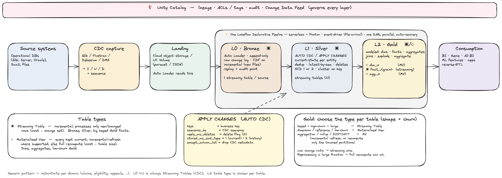

# NRT Claims CDC on Lakeflow Declarative Pipelines

A near-real-time CDC demo on a serverless **Lakeflow Declarative Pipeline (LDP)**.
Qlik-style change-data-capture parquet (insert / update / delete + sequence) lands
in a Unity Catalog **Volume**, **Auto Loader** ingests it into an append-only
**L0 bronze** change log, **AUTO CDC / APPLY CHANGES** resolves it into current-state
**L1 silver** tables, and an **L2 gold** star schema (dims + facts + aggregates) is
built on top. Generic medallion + CDC pattern, instantiated for claims — the same
shape applies to any CDC source.



> Editable source: `docs/architecture_generic.excalidraw` (open at excalidraw.com).
> Mermaid variants: `docs/architecture.mmd`, `docs/architecture_stacked.mmd`.

## What it demonstrates

1. **Multi-table parallelism** — 9 source tables, each its own AUTO CDC flow,
   advancing concurrently in one pipeline DAG (the "scales to 150 tables" story).
2. **Volume within SLA** — seed a large history, land a realistic increment, and
   watch the merge prune (liquid clustering on the key + deletion vectors + Photon).
3. **No skew from provider hot spots** — concentrate up to 80% of an increment on
   one provider; the merge is unaffected because AUTO CDC keys on the
   high-cardinality `claim_id`, not on `provider_id`.
4. **MV vs. streaming for the modeled layer** — gold built as Materialized Views,
   with a streaming twin of the line fact to compare full-recompute vs. incremental.

## Architecture & table types

Everything is a Unity Catalog managed Delta table. The **LDP dataset type** sets
how each stays fresh:

- **▣ Streaming Table** — incremental; processes only new/changed rows (cost ∝ change set).
  Used for **L0 bronze** (Auto Loader) and **L1 silver** (APPLY CHANGES).
- **◇ Materialized View** — a query the engine keeps current; incremental-refresh where
  the shape qualifies, else full recompute (cost ∝ table size). Used for most **L2 gold**.

```
Qlik-style CDC parquet (I/U/D + change_seq)
   │  → UC Volume: landing/<table>/        (Auto Loader · file-arrival trigger)
   ▼
L0 Bronze  ▣  <table>_bronze               append-only raw change log · CDF
   │  AUTO CDC: keys=<pk>, sequence_by=header__change_seq, apply_as_deletes 'D'
   ▼
L1 Silver  ▣  <table>                      current-state · SCD1 · liquid-clustered on claim_id · DV
   │  joins · explode · aggregate
   ▼
L2 Gold    ◇/▣  dims · facts · aggregates  modeled star schema (not 1:1)
```

**Choosing the gold table type** (by shape + churn): keyed + high-churn + large →
Streaming Table; dimension / reference / low-churn → MV; aggregation / rollup → MV
(incremental refresh or bounded recompute).

## Data model

**L1 Silver — current-state (9 streaming tables):** `claim`, `claim_detail`,
`claim_attribute`, `claim_audit`, `claim_payment`, `claim_diagnosis`, `provider`,
`member`, `payer`. `src/pipeline/table_specs.py` is the single source of truth (the
generator and pipeline both read it, so schema/keys never drift).

**L2 Gold — modeled star schema:**

| Table | Type | Grain / role |
|---|---|---|
| `dim_provider` / `dim_member` / `dim_payer` / `dim_date` | ◇ MV | conformed dimensions |
| `dim_procedure` / `dim_diagnosis` | ◇ MV | snowflaked code dims |
| `fact_claim_line` | ◇ MV | line grain — detail exploded + joined to header & dims |
| `fact_claim_line_streaming` | ▣ Streaming | incremental twin of the line fact (APPLY CHANGES) |
| `fact_claim` | ◇ MV | header grain — line measures aggregated up + metrics |
| `agg_claims_daily` | ◇ MV | day × payer × provider KPI rollup |

## Repo layout

```
databricks.yml                      bundle + variables + dev target
resources/                          schema/volumes (via setup job), pipeline, jobs
src/setup/00_uc_setup.py            create catalog (if permitted) + schema + volumes
src/data_gen/                       synthetic Qlik-CDC generator + seed/increment entry points
src/pipeline/table_specs.py         single source of truth (9 tables)
src/pipeline/bronze.py              Auto Loader → *_bronze (streaming tables)
src/pipeline/silver_apply_changes.py  APPLY CHANGES → silver (streaming tables)
src/pipeline/gold.py                dims + facts + aggregates (MVs) + streaming twin
docs/                               architecture diagrams (excalidraw + mermaid + png)
```

## Configuration

All deployment values are bundle **variables** in `databricks.yml`:

| Variable | Default | Meaning |
|---|---|---|
| `catalog` | `claims_nrt_demo` | UC catalog — **specify per workspace** (see below) |
| `schema` | `claims` | schema for volume + tables |
| `landing_volume` | `landing` | CDC landing volume |
| `state_volume` | `pipeline_state` | Auto Loader schema-tracking volume |
| `warehouse_id` | *(starter)* | SQL warehouse for validation queries |
| `rows_per_increment` | `417000` | header changes per increment |
| `seed_rows` | `100000000` | historical claim-detail rows to seed |
| `provider_concentration` | `0.0` | fraction of an increment on one hot provider |

**The catalog is a deploy-time parameter** — objects are created by `setup_job` (not
the bundle), so it never has to be hardcoded:

```bash
databricks bundle deploy -t dev --var="catalog=my_existing_catalog"
# or:  export BUNDLE_VAR_catalog=my_existing_catalog && databricks bundle deploy -t dev
```

`setup_job` creates the catalog if you have `CREATE CATALOG`; otherwise the named
catalog must already exist and it just creates the schema + volumes inside it.

## Runbook

```bash
# the workspace host comes from your CLI profile (no host is hardcoded in the bundle)
export BUNDLE_VAR_catalog=my_existing_catalog

# 0. deploy  (pass your profile; its host is the deploy target)
databricks bundle deploy -t dev --profile <your-profile>

# 1. one-time per workspace: catalog (if permitted) + schema + volumes
databricks bundle run setup_job -t dev

# 2. one-time: seed history, then run the pipeline to build the baseline
databricks bundle run seed_history_job -t dev
databricks bundle run nrt_claims_pipeline -t dev

# 3. land an increment (the file-arrival trigger also fires the pipeline)
databricks bundle run generate_increment_job -t dev

# 4. skew showcase — even vs. one provider at 80% (each generates + runs the pipeline)
databricks bundle run skew_demo_even_job -t dev
databricks bundle run skew_demo_hot_job  -t dev
```

The increment mix is controllable via job parameters:
`-- --rows_per_increment=… --provider_concentration=… --pct_new=… --pct_header_only=… --pct_adjustment=… --pct_reversal=…`

## Measured results (example run)

- **Skew:** an increment with **80% of writes on one provider** merges with the same
  task profile as an even increment — APPLY CHANGES keys on `claim_id`, not `provider_id`.
- **MV vs. streaming:** for a 417k-claim increment (~1.4M changed lines), the MV
  `fact_claim_line` **full-recomputed ~111M rows** while the streaming twin processed
  **~1.4M** (~78× less). Both hold identical results.
- **Change-ratio crossover:** when an increment is a large fraction of the table
  (e.g. ~25M changes vs ~114M ≈ 20%), full recompute can beat streaming. Incremental
  wins — and is far cheaper — at the low change ratios of real steady state.

## Notes

- **Triggers in dev mode:** `mode: development` auto-pauses the file-arrival trigger.
  Unpause it (or use a non-dev target) to demo the auto-fire.
- **SCD2 talk-track:** `claim` / `claim_audit` are natural SCD Type 2 candidates —
  flip `stored_as_scd_type` to `2` for a time-versioned history of every state change.
- If the CLI can't download Terraform, point it at a local install:
  `export DATABRICKS_TF_EXEC_PATH=$(which terraform)`.
